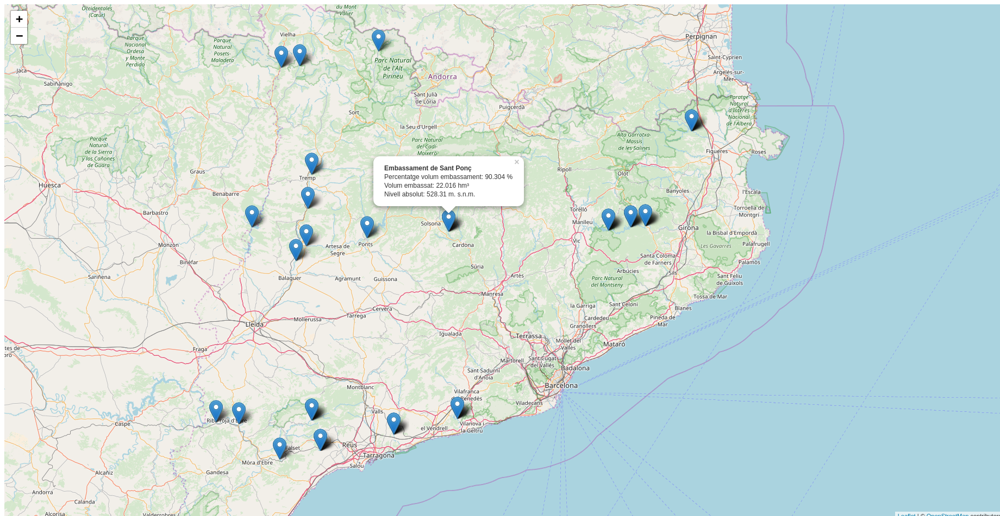

# Ejemplo Sentilo ACA

## Acceso al servicio de sensores Sentilo de la ACA

En el apartado de consulta de datos de la página de la ACA [^1] encontraremos un subapartado de datos en tiempo real, estos datos los sirven utilizando la plataforma de sensores Sentilo [^2]. Los sensores dan información sobre los diferentes embalses/pantanos que hay en Cataluña.

La página tiene un acceso a un mapa con los datos de los diferentes sensores [^3] este mapa es el que ofrece la plataforma de Sentilo y está basado en tecnología de Google Maps.

También encontraremos la documentación [^4] para usar la API, lo que nos permite acceder a los datos y generar nuestro propio visor.

## Creación de un visor

Para crear un visor de mapas utilizaremos la librería de mapas Leaflet [^5].  

- Crear una carpeta con el nombre de *visor-aca*.

- Crear un archivo con el nombre de *index.html* dentro de la carpeta.

- Abrir el archivo index.html con un editor de texto y copiar el siguiente código.

```html
<!DOCTYPE html>
<html>
<head>
  <meta charset="UTF-8">
    <meta name="viewport" content="width=device-width, initial-scale=1.0">
    <meta http-equiv="X-UA-Compatible" content="ie=edge">
  <title>Ejemplo Sentilo ACA</title>
  <link rel="stylesheet" href="https://unpkg.com/leaflet@1.2.0/dist/leaflet.css" />
  <style>
    #map {
        height: 100%;
        width: 100%;
        position: absolute;
    }
  </style>
</head>
<body>

  <div id="map"></div>

  <script src="https://unpkg.com/leaflet@1.2.0/dist/leaflet.js"></script>
  <script>
    var map = L.map('map');

    map.setView([41.5087, 2.1777], 8);  

    L.tileLayer('http://{s}.tile.osm.org/{z}/{x}/{y}.png', {
        attribution: '&copy; <a href="http://osm.org/copyright">OpenStreetMap</a> contributors'
    }).addTo(map);
  </script>
</body>
</html>
```

- Abrir el archivo index.html en el navegador para confirmar que se carga un mapa centrado en Cataluña.

- Consultar la documentación de la API y buscar la url de descripción del servicio que es http://aca-web.gencat.cat/sdim2/apirest/catalog. Abrir esta url en el navegador y confirmar que responde un JSON con la información de los diferentes sensores.

- Revisar el JSON de salida y buscar la propiedad *location* que indica las coordenadas de la ubicación del sensor. A pesar de que el JSON tiene coordenadas no es un GeoJSON y por lo tanto no lo podemos pintar automáticamente en nuestro mapa.

- Cargar este JSON en nuestro mapa utilizando un plugin de Leaflet llamado *leaflet-ajax* [^6]. Este plugin permite hacer una llamada AJAX a un servicio que retorne un JSON y cargar la respuesta en un mapa. Para cargar este plugin debemos agregar lo siguiente justo después de donde hemos cargado el leaflet

```html hl_lines="22"
<!DOCTYPE html>
<html>
<head>
  <meta charset="UTF-8">
    <meta name="viewport" content="width=device-width, initial-scale=1.0">
    <meta http-equiv="X-UA-Compatible" content="ie=edge">
  <title>Ejemplo Sentilo ACA</title>
  <link rel="stylesheet" href="https://unpkg.com/leaflet@1.2.0/dist/leaflet.css" />
  <style>
    #map {
        height: 100%;
        width: 100%;
        position: absolute;
    }
  </style>
</head>
<body>

  <div id="map"></div>

  <script src="https://unpkg.com/leaflet@1.2.0/dist/leaflet.js"></script>
  <script src="https://calvinmetcalf.github.io/leaflet-ajax/dist/leaflet.ajax.js"></script>
  <script>
    var map = L.map('map');

    map.setView([41.5087, 2.1777], 8);  

    L.tileLayer('http://{s}.tile.osm.org/{z}/{x}/{y}.png', {
        attribution: '&copy; <a href="http://osm.org/copyright">OpenStreetMap</a> contributors'
    }).addTo(map);
  </script>
</body>
</html>
```

- Utilizar el plugin para agregar la capa al mapa llamando a la API de la ACA. Agregar lo siguiente al final de nuestro código:

```html hl_lines="32"
<!DOCTYPE html>
<html>
<head>
  <meta charset="UTF-8">
    <meta name="viewport" content="width=device-width, initial-scale=1.0">
    <meta http-equiv="X-UA-Compatible" content="ie=edge">
  <title>Ejemplo Sentilo ACA</title>
  <link rel="stylesheet" href="https://unpkg.com/leaflet@1.2.0/dist/leaflet.css" />
  <style>
    #map {
        height: 100%;
        width: 100%;
        position: absolute;
    }
  </style>
</head>
<body>

  <div id="map"></div>

  <script src="https://unpkg.com/leaflet@1.2.0/dist/leaflet.js"></script>
  <script src="https://calvinmetcalf.github.io/leaflet-ajax/dist/leaflet.ajax.js"></script>
  <script>
    var map = L.map('map');

    map.setView([41.5087, 2.1777], 8);  

    L.tileLayer('http://{s}.tile.osm.org/{z}/{x}/{y}.png', {
      attribution: '&copy; <a href="http://osm.org/copyright">OpenStreetMap</a> contributors'
    }).addTo(map);

    var geojsonLayer = new L.GeoJSON.AJAX('http://aca-web.gencat.cat/sdim2/apirest/catalog').addTo(map);
  </script>
</body>
</html>
```

- Recargar la página y confirmar que no aparece ninguna información en el mapa. Abrir la consola de desarrollador del navegador (Ctrl+F12) para ver que aparece un mensaje de error *XMLHttpRequest cannot load ...* ello es debido a que estamos llamando a un servicio que no está en nuestro dominio y por lo tanto da un error de CORS [^7]. Para evitar el error de CORS necesitamos un proxy [^8] en nuestro servidor web que pueda hacer la llamada al servicio de la ACA y que nos devuelva el contenido.

## Creación del proxy

- Instalar Node.js [^9]. Descargar la última versión LTS (en este momento es la 10.13.0 LTS) y lo instalaremos con las opciones por defecto. Abrir la consola para verificar que se ha instalado correctamente y escribir ::

```bash
node -v
```

- Navegar hasta nuestra carpeta *visor-aca* y escribir: ::

```bash
npm init
```

Con este comando estaremos creando el archivo *package.json*, el cual solicita varios elementos como por ejemplo; el nombre y la versión de la aplicación. Por ahora, sólo hay que pulsar ENTER para aceptar los valores predeterminados.

- Instalar las dependencias para crear nuestro servicio de proxy. En este caso utilizaremos Express [^10] como servidor web y el módulo http-proxy [^11].

- Instalar el express y guardarlo en la lista de dependencias ::

```bash
npm install express --save
```

- Instalar el http-proxy y guardarlo en la lista de dependencias ::

```bash
npm install http-proxy --save
```

Al ejecutar estos comandos veremos que se crea una carpeta llamada *node_modules* donde se guardan los módulos instalados.

- Crear un archivo llamado *app.js* que servirá de proxy con el servicio de la ACA. Copiar lo siguiente en este archivo.

```js
var express  = require('express');
var app      = express();
var httpProxy = require('http-proxy');
var apiProxy = httpProxy.createProxyServer();
var serverAca = 'http://aca-web.gencat.cat/sdim2/apirest/catalog';

app.get('/', function(req, res){
  res.sendFile(__dirname + '/index.html');
});

app.all("/aca/*", function(req, res) {
  console.log('redirecting to Server1');
  apiProxy.web(req, res, {
    target: serverAca,
    changeOrigin: false, 
    ignorePath: true
  });
});

app.listen(3000);
```

- Probar que nuestro proxy está funcionando, escribir:

```bash
node app.js
```

- Abrir la url de nuestro proxy http://localhost:3000/aca/ en el navegador.

- Escribir en el navegador http://localhost:3000 y ver nuestro mapa.

### Modificar el mapa

- Modificar el archivo index.html para que llame al proxy que hemos creado. Cambiar la url de la capa geojsonLayer *http://aca-web.gencat.cat/sdim2/apirest/catalog* por nuestro proxy *http://localhost:3000/aca/* (como el proxy y la aplicación están en el mismo servidor podríamos usar */aca/*).

```html hl_lines="32"
<!DOCTYPE html>
<html>
<head>
  <meta charset="UTF-8">
    <meta name="viewport" content="width=device-width, initial-scale=1.0">
    <meta http-equiv="X-UA-Compatible" content="ie=edge">
  <title>Ejemplo Sentilo ACA</title>
  <link rel="stylesheet" href="https://unpkg.com/leaflet@1.2.0/dist/leaflet.css" />
  <style>
    #map {
        height: 100%;
        width: 100%;
        position: absolute;
    }
  </style>
</head>
<body>

  <div id="map"></div>

  <script src="https://unpkg.com/leaflet@1.2.0/dist/leaflet.js"></script>
  <script src="https://calvinmetcalf.github.io/leaflet-ajax/dist/leaflet.ajax.js"></script>
  <script>
    var map = L.map('map');

    map.setView([41.5087, 2.1777], 8);  

    L.tileLayer('http://{s}.tile.osm.org/{z}/{x}/{y}.png', {
      attribution: '&copy; <a href="http://osm.org/copyright">OpenStreetMap</a> contributors'
    }).addTo(map);

    var geojsonLayer = new L.GeoJSON.AJAX('http://localhost:3000/aca/').addTo(map);
  </script>
</body>
</html>
```

- Recargar la aplicación con Ctrl+F5 y vemos que el error ha desaparecido. Continuaremos sin ver ningún dato en nuestro mapa. Esto es debido a lo que ya mencionamos; que la API no retorna un GeoJSON. Por lo tanto tendremos que convertir la respuesta de la API en un GeoJSON.

- Convertir la respuesta en un GeoJSON utilizando la opción *middleware* que ofrece la capa GeoJSON.AJAX. Esta opción permite crear una funcion donde se pueden manipular los datos antes de agregarlos al mapa. Crear la función que transforma los datos de Sentilo de la ACA en un GeoJSON. Escribir al final de nuestro código

```html hl_lines="34 35 36 37 38 39 40 41 42 43 44 45 46 47 48 49 50 51 52 53 54 55 56 57 58 59 60"
<!DOCTYPE html>
<html>
<head>
  <meta charset="UTF-8">
    <meta name="viewport" content="width=device-width, initial-scale=1.0">
    <meta http-equiv="X-UA-Compatible" content="ie=edge">
  <title>Ejemplo Sentilo ACA</title>
  <link rel="stylesheet" href="https://unpkg.com/leaflet@1.2.0/dist/leaflet.css" />
  <style>
    #map {
        height: 100%;
        width: 100%;
        position: absolute;
    }
  </style>
</head>
<body>

  <div id="map"></div>

  <script src="https://unpkg.com/leaflet@1.2.0/dist/leaflet.js"></script>
  <script src="https://calvinmetcalf.github.io/leaflet-ajax/dist/leaflet.ajax.js"></script>
  <script>
    var map = L.map('map');

    map.setView([41.5087, 2.1777], 8);  

    L.tileLayer('http://{s}.tile.osm.org/{z}/{x}/{y}.png', {
      attribution: '&copy; <a href="http://osm.org/copyright">OpenStreetMap</a> contributors'
    }).addTo(map);

    var geojsonLayer = new L.GeoJSON.AJAX('http://localhost:3000/aca/').addTo(map);

    function sentiloAca2geoJSON(data){
      var geojson = {
        type: "FeatureCollection",
        features: []
      };
      var sensors = data.providers[0].sensors;
      for (var i = sensors.length - 1; i >= 0; i--) {
        var sensor = sensors[i];
        var location = sensor.location.split(" ");
        var feature = {
          type: 'Feature',
          properties: {
            description: sensor.description,
            id: sensor.component,
            nom: sensor.componentDesc,
            info: sensor.componentAdditionalInfo,
            unit: sensor.unit
          },
          geometry: {
            type: 'Point',
            coordinates: [location[1], location[0]]
          }
      };
      geojson.features.push(feature);
      }
      return geojson;
    }
  </script>
</body>
</html>
```

- Modficar la capa geojsonLayer para que el middleware llame a nuestra función de transformación. Cambiar el código de la capa por lo siguiente:

```html hl_lines="32 33 34 35 36"
<!DOCTYPE html>
<html>
<head>
  <meta charset="UTF-8">
    <meta name="viewport" content="width=device-width, initial-scale=1.0">
    <meta http-equiv="X-UA-Compatible" content="ie=edge">
  <title>Ejemplo Sentilo ACA</title>
  <link rel="stylesheet" href="https://unpkg.com/leaflet@1.2.0/dist/leaflet.css" />
  <style>
    #map {
        height: 100%;
        width: 100%;
        position: absolute;
    }
  </style>
</head>
<body>

  <div id="map"></div>

  <script src="https://unpkg.com/leaflet@1.2.0/dist/leaflet.js"></script>
  <script src="https://calvinmetcalf.github.io/leaflet-ajax/dist/leaflet.ajax.js"></script>
  <script>
    var map = L.map('map');

    map.setView([41.5087, 2.1777], 8);  

    L.tileLayer('http://{s}.tile.osm.org/{z}/{x}/{y}.png', {
      attribution: '&copy; <a href="http://osm.org/copyright">OpenStreetMap</a> contributors'
    }).addTo(map);

    var geojsonLayer = new L.GeoJSON.AJAX('http://localhost:3000/aca/', {
      middleware:function(data){
        return sentiloAca2geoJSON(data);
      }
    }).addTo(map);

    function sentiloAca2geoJSON(data){
      var geojson = {
        type: "FeatureCollection",
        features: []
      };
      var sensors = data.providers[0].sensors;
      for (var i = sensors.length - 1; i >= 0; i--) {
        var sensor = sensors[i];
        var location = sensor.location.split(" ");
        var feature = {
          type: 'Feature',
          properties: {
            description: sensor.description,
            id: sensor.component,
            nom: sensor.componentDesc,
            info: sensor.componentAdditionalInfo,
            unit: sensor.unit
          },
          geometry: {
            type: 'Point',
            coordinates: [location[1], location[0]]
          }
      };
      geojson.features.push(feature);
      }
      return geojson;
    }
  </script>
</body>
</html>
```

- Recargar el mapa y ver los puntos de los embalses en el mapa.

- Mostrar la información del punto. Agregar el evento click en cada unos de los puntos. Utilizar la opción de *onEachFeature* que ofrece las capa GeoJSON de Leaflet. Esta opción permite ejecutar una función en la creación de cada uno de los elementos de la capa. Es muy útil para agregar popups a los elementos ó para agregar eventos en los elementos.

- Crear una función llamada *eachFeature* que recibe como parámetros un feature (elemento del GeoJSON) y un layer (elemento de Leaflet). La función sería la siguiente

```html hl_lines="66 67 68 69 70 71"
<!DOCTYPE html>
<html>
<head>
  <meta charset="UTF-8">
    <meta name="viewport" content="width=device-width, initial-scale=1.0">
    <meta http-equiv="X-UA-Compatible" content="ie=edge">
  <title>Ejemplo Sentilo ACA</title>
  <link rel="stylesheet" href="https://unpkg.com/leaflet@1.2.0/dist/leaflet.css" />
  <style>
    #map {
        height: 100%;
        width: 100%;
        position: absolute;
    }
  </style>
</head>
<body>

  <div id="map"></div>

  <script src="https://unpkg.com/leaflet@1.2.0/dist/leaflet.js"></script>
  <script src="https://calvinmetcalf.github.io/leaflet-ajax/dist/leaflet.ajax.js"></script>
  <script>
    var map = L.map('map');

    map.setView([41.5087, 2.1777], 8);  

    L.tileLayer('http://{s}.tile.osm.org/{z}/{x}/{y}.png', {
      attribution: '&copy; <a href="http://osm.org/copyright">OpenStreetMap</a> contributors'
    }).addTo(map);

    var geojsonLayer = new L.GeoJSON.AJAX('http://localhost:3000/aca/', {
      middleware:function(data){
        return sentiloAca2geoJSON(data);
      }
    }).addTo(map);

    function sentiloAca2geoJSON(data){
      var geojson = {
        type: "FeatureCollection",
        features: []
      };
      var sensors = data.providers[0].sensors;
      for (var i = sensors.length - 1; i >= 0; i--) {
        var sensor = sensors[i];
        var location = sensor.location.split(" ");
        var feature = {
          type: 'Feature',
          properties: {
            description: sensor.description,
            id: sensor.component,
            nom: sensor.componentDesc,
            info: sensor.componentAdditionalInfo,
            unit: sensor.unit
          },
          geometry: {
            type: 'Point',
            coordinates: [location[1], location[0]]
          }
      };
      geojson.features.push(feature);
      }
      return geojson;
    }

    function eachFeature(f,l){
      l.on('click',function(ev){
        console.log(f);
        console.log(l);
      });
    }
  </script>
</body>
</html>
```

- Llamar a la funcion eachFeature en la opción *onEachFeature* de la capa geojsonLayer. Escribir lo siguiente luego de la opción del middleware

```html hl_lines="36"
<!DOCTYPE html>
<html>
<head>
  <meta charset="UTF-8">
    <meta name="viewport" content="width=device-width, initial-scale=1.0">
    <meta http-equiv="X-UA-Compatible" content="ie=edge">
  <title>Ejemplo Sentilo ACA</title>
  <link rel="stylesheet" href="https://unpkg.com/leaflet@1.2.0/dist/leaflet.css" />
  <style>
    #map {
        height: 100%;
        width: 100%;
        position: absolute;
    }
  </style>
</head>
<body>

  <div id="map"></div>

  <script src="https://unpkg.com/leaflet@1.2.0/dist/leaflet.js"></script>
  <script src="https://calvinmetcalf.github.io/leaflet-ajax/dist/leaflet.ajax.js"></script>
  <script>
    var map = L.map('map');

    map.setView([41.5087, 2.1777], 8);  

    L.tileLayer('http://{s}.tile.osm.org/{z}/{x}/{y}.png', {
      attribution: '&copy; <a href="http://osm.org/copyright">OpenStreetMap</a> contributors'
    }).addTo(map);

    var geojsonLayer = new L.GeoJSON.AJAX('http://localhost:3000/aca/', {
      middleware:function(data){
        return sentiloAca2geoJSON(data);
      }
      ,onEachFeature: eachFeature
    }).addTo(map);

    function sentiloAca2geoJSON(data){
      var geojson = {
        type: "FeatureCollection",
        features: []
      };
      var sensors = data.providers[0].sensors;
      for (var i = sensors.length - 1; i >= 0; i--) {
        var sensor = sensors[i];
        var location = sensor.location.split(" ");
        var feature = {
          type: 'Feature',
          properties: {
            description: sensor.description,
            id: sensor.component,
            nom: sensor.componentDesc,
            info: sensor.componentAdditionalInfo,
            unit: sensor.unit
          },
          geometry: {
            type: 'Point',
            coordinates: [location[1], location[0]]
          }
      };
      geojson.features.push(feature);
      }
      return geojson;
    }

    function eachFeature(f,l){
      l.on('click',function(ev){
        console.log(f);
        console.log(l);
      });
    }
  </script>
</body>
</html>
```

- Recargar el mapa y hacer click sobre un elemento. En la consola de desarrollador ver que aparecen 2 entradas una que corresponde al feature y otra al layer.

- Llamar a la API de la ACA para pedir la última lectura del sensor y así obtener la información. La url para obtener la última lectura es http://aca-web.gencat.cat/sentilo-catalog-web/component/map/EMBASSAMENT-EST.*.<id_sensor>*/lastOb/.

    Por ejemplo:

    http://aca-web.gencat.cat/sentilo-catalog-web/component/map/EMBASSAMENT-EST.L25075-72-00003/lastOb/

    Como estamos llamando una url que está fuera de nuestro dominio tenemos el mismo problema de CORS.

### Modificar el proxy

- Modificar nuestro proxy para obtener la información de un sensor. Escribir en nuestro archivo app.js justo debajo de la declaración de la variable *serverAca*

```js hl_lines="6"
var express  = require('express');
var app      = express();
var httpProxy = require('http-proxy');
var apiProxy = httpProxy.createProxyServer();
var serverAca = 'http://aca-web.gencat.cat/sdim2/apirest/catalog';
var serverAcaLastOb = 'http://aca-web.gencat.cat/sentilo-catalog-web/component/map/EMBASSAMENT-EST.';

app.get('/', function(req, res){
  res.sendFile(__dirname + '/index.html');
});

app.all("/aca/*", function(req, res) {
  console.log('redirecting to Server1');
  apiProxy.web(req, res, {
    target: serverAca,
    changeOrigin: false, 
    ignorePath: true
  });
});

app.listen(3000);
```

- Agregar justo antes del app.listen el código que nos va a ser de proxy.

```js hl_lines="21 22 23 24 25 26 27 28"
var express  = require('express');
var app      = express();
var httpProxy = require('http-proxy');
var apiProxy = httpProxy.createProxyServer();
var serverAca = 'http://aca-web.gencat.cat/sdim2/apirest/catalog';
var serverAcaLastOb = 'http://aca-web.gencat.cat/sentilo-catalog-web/component/map/EMBASSAMENT-EST.';

app.get('/', function(req, res){
  res.sendFile(__dirname + '/index.html');
});

app.all("/aca/*", function(req, res) {
  console.log('redirecting to Server1');
  apiProxy.web(req, res, {
    target: serverAca,
    changeOrigin: false, 
    ignorePath: true
  });
});

app.all("/acalast/:id", function(req, res){
  console.log('redirecting to Server2' + req.params.id);
  apiProxy.web(req, res, {
    target: serverAcaLastOb+req.params.id+'/lastOb/',
    changeOrigin: false,
    ignorePath: true
  });
});

app.listen(3000);
```

- Reiniciar nuestro servidor de node, ir a la consola y presionar Crtl+c. Escribir node app.js.

- Abrir la url http://localhost:3000/acalast/L25075-72-00003 en el navegador para comprobar que el proxy está funcionando correctamente.

- Modificar la función que se llama al hacer click sobre un elemento del mapa para que llame a nuestro proxy. Esta función ejecutará una llamada ajax al proxy. Modificar la función *eachFeature* con el siguiente código

```html hl_lines="69 70 71 72 73 74 75 76"
<!DOCTYPE html>
<html>
<head>
  <meta charset="UTF-8">
    <meta name="viewport" content="width=device-width, initial-scale=1.0">
    <meta http-equiv="X-UA-Compatible" content="ie=edge">
  <title>Ejemplo Sentilo ACA</title>
  <link rel="stylesheet" href="https://unpkg.com/leaflet@1.2.0/dist/leaflet.css" />
  <style>
    #map {
        height: 100%;
        width: 100%;
        position: absolute;
    }
  </style>
</head>
<body>

  <div id="map"></div>

  <script src="https://unpkg.com/leaflet@1.2.0/dist/leaflet.js"></script>
  <script src="https://calvinmetcalf.github.io/leaflet-ajax/dist/leaflet.ajax.js"></script>
  <script>
    var map = L.map('map');

    map.setView([41.5087, 2.1777], 8);  

    L.tileLayer('http://{s}.tile.osm.org/{z}/{x}/{y}.png', {
      attribution: '&copy; <a href="http://osm.org/copyright">OpenStreetMap</a> contributors'
    }).addTo(map);

    var geojsonLayer = new L.GeoJSON.AJAX('http://localhost:3000/aca/', {
      middleware:function(data){
        return sentiloAca2geoJSON(data);
      }
      ,onEachFeature: eachFeature
    }).addTo(map);

    function sentiloAca2geoJSON(data){
      var geojson = {
        type: "FeatureCollection",
        features: []
      };
      var sensors = data.providers[0].sensors;
      for (var i = sensors.length - 1; i >= 0; i--) {
        var sensor = sensors[i];
        var location = sensor.location.split(" ");
        var feature = {
          type: 'Feature',
          properties: {
            description: sensor.description,
            id: sensor.component,
            nom: sensor.componentDesc,
            info: sensor.componentAdditionalInfo,
            unit: sensor.unit
          },
          geometry: {
            type: 'Point',
            coordinates: [location[1], location[0]]
          }
      };
      geojson.features.push(feature);
      }
      return geojson;
    }

    function eachFeature(f,l){
      l.on('click',function(ev){
        var url = 'http://localhost:3000/acalast/'+f.properties.id;
        fetch(url)
        .then(function(response) {
          console.log(response);
        })
        .then(function(myJson) {
          console.log(myJson);
        });
      });
    }
  </script>
</body>
</html>
```

- Recargar el mapa y hacer click sobre un elemento para ver que en la consola del desarrollador aparece un objeto que contiene la respuesa del sensor con la información de la última lectura.

- Crear una función llamada *popUp* para mostrar esta información en el mapa. La función recibe como parámetros un layer de Leaflet y unos datos del sensor. Esta función muestra un popup asociado al elemento con la información del sensor. Escribir después de la función eachFeature

```html hl_lines="80 81 82 83 84 85 86 87 88 89 90 91"
<!DOCTYPE html>
<html>
<head>
  <meta charset="UTF-8">
    <meta name="viewport" content="width=device-width, initial-scale=1.0">
    <meta http-equiv="X-UA-Compatible" content="ie=edge">
  <title>Ejemplo Sentilo ACA</title>
  <link rel="stylesheet" href="https://unpkg.com/leaflet@1.2.0/dist/leaflet.css" />
  <style>
    #map {
        height: 100%;
        width: 100%;
        position: absolute;
    }
  </style>
</head>
<body>

  <div id="map"></div>

  <script src="https://unpkg.com/leaflet@1.2.0/dist/leaflet.js"></script>
  <script src="https://calvinmetcalf.github.io/leaflet-ajax/dist/leaflet.ajax.js"></script>
  <script>
    var map = L.map('map');

    map.setView([41.5087, 2.1777], 8);  

    L.tileLayer('http://{s}.tile.osm.org/{z}/{x}/{y}.png', {
      attribution: '&copy; <a href="http://osm.org/copyright">OpenStreetMap</a> contributors'
    }).addTo(map);

    var geojsonLayer = new L.GeoJSON.AJAX('http://localhost:3000/aca/', {
      middleware:function(data){
        return sentiloAca2geoJSON(data);
      }
      ,onEachFeature: eachFeature
    }).addTo(map);

    function sentiloAca2geoJSON(data){
      var geojson = {
        type: "FeatureCollection",
        features: []
      };
      var sensors = data.providers[0].sensors;
      for (var i = sensors.length - 1; i >= 0; i--) {
        var sensor = sensors[i];
        var location = sensor.location.split(" ");
        var feature = {
          type: 'Feature',
          properties: {
            description: sensor.description,
            id: sensor.component,
            nom: sensor.componentDesc,
            info: sensor.componentAdditionalInfo,
            unit: sensor.unit
          },
          geometry: {
            type: 'Point',
            coordinates: [location[1], location[0]]
          }
      };
      geojson.features.push(feature);
      }
      return geojson;
    }

    function eachFeature(f,l){
      l.on('click',function(ev){
        var url = 'http://localhost:3000/acalast/'+f.properties.id;
        fetch(url)
        .then(function(response) {
          console.log(response);
        })
        .then(function(myJson) {
          console.log(myJson);
        });
      });
    }

    function popUp(l, data){
      var out = [];
      out.push('<strong>'+data.componentDesc+'</strong>');
        if (data.sensorLastObservations){
          for (var i = data.sensorLastObservations.length - 1; i >= 0; i--) {
            var observ = data.sensorLastObservations[i];
            out.push(observ.sensorType+": "+observ.value+" "+observ.unit);
          }
        }
        l.unbindPopup();
        l.bindPopup(out.join("<br />")).togglePopup();
    }
  </script>
</body>
</html>
```

- Llamar a la función popUp dentro de la función que se llama en el *success* de la llamada ajax. Escribir

```html hl_lines="73"
<!DOCTYPE html>
<html>
<head>
  <meta charset="UTF-8">
    <meta name="viewport" content="width=device-width, initial-scale=1.0">
    <meta http-equiv="X-UA-Compatible" content="ie=edge">
  <title>Ejemplo Sentilo ACA</title>
  <link rel="stylesheet" href="https://unpkg.com/leaflet@1.2.0/dist/leaflet.css" />
  <style>
    #map {
        height: 100%;
        width: 100%;
        position: absolute;
    }
  </style>
</head>
<body>

  <div id="map"></div>

  <script src="https://unpkg.com/leaflet@1.2.0/dist/leaflet.js"></script>
  <script src="https://calvinmetcalf.github.io/leaflet-ajax/dist/leaflet.ajax.js"></script>
  <script>
    var map = L.map('map');

    map.setView([41.5087, 2.1777], 8);  

    L.tileLayer('http://{s}.tile.osm.org/{z}/{x}/{y}.png', {
      attribution: '&copy; <a href="http://osm.org/copyright">OpenStreetMap</a> contributors'
    }).addTo(map);

    var geojsonLayer = new L.GeoJSON.AJAX('http://localhost:3000/aca/', {
      middleware:function(data){
        return sentiloAca2geoJSON(data);
      }
      ,onEachFeature: eachFeature
    }).addTo(map);

    function sentiloAca2geoJSON(data){
      var geojson = {
        type: "FeatureCollection",
        features: []
      };
      var sensors = data.providers[0].sensors;
      for (var i = sensors.length - 1; i >= 0; i--) {
        var sensor = sensors[i];
        var location = sensor.location.split(" ");
        var feature = {
          type: 'Feature',
          properties: {
            description: sensor.description,
            id: sensor.component,
            nom: sensor.componentDesc,
            info: sensor.componentAdditionalInfo,
            unit: sensor.unit
          },
          geometry: {
            type: 'Point',
            coordinates: [location[1], location[0]]
          }
      };
      geojson.features.push(feature);
      }
      return geojson;
    }

    function eachFeature(f,l){
      l.on('click',function(ev){
        var url = 'http://localhost:3000/acalast/'+f.properties.id;
        fetch(url)
        .then(function(response) {
          console.log(response);
          popUp(l, response);
        })
        .then(function(myJson) {
          console.log(myJson);
        });
      });
    }

    function popUp(l, data){
      var out = [];
      out.push('<strong>'+data.componentDesc+'</strong>');
        if (data.sensorLastObservations){
          for (var i = data.sensorLastObservations.length - 1; i >= 0; i--) {
            var observ = data.sensorLastObservations[i];
            out.push(observ.sensorType+": "+observ.value+" "+observ.unit);
          }
        }
        l.unbindPopup();
        l.bindPopup(out.join("<br />")).togglePopup();
    }
  </script>
</body>
</html>
```

- Recargar la aplicación y clicar sobre un elemento. Debe aparecer un popup con la información de la última lectura del sensor.


*ejemplo sentilo ACA*

## Referencias

[^1]: http://aca.gencat.cat/ca/laigua/consulta-de-dades/dades-obertes/
[^2]: http://www.sentilo.io/wordpress/
[^3]: http://aca-web.gencat.cat/sentilo-catalog-web/component/map
[^4]: http://aca.gencat.cat/web/.content/20_Aigua/08_consulta_de_dades/01_dades_obertes/us_serveis_dades_API_REST.pdf
[^5]: http://leafletjs.com/
[^6]: https://github.com/calvinmetcalf/leaflet-ajax
[^7]: https://developer.mozilla.org/es/docs/Web/HTTP/Access_control_CORS
[^8]: https://es.wikipedia.org/wiki/Servidor_proxy
[^9]: https://nodejs.org/es/
[^10]: http://expressjs.com/
[^11]: https://github.com/nodejitsu/node-http-proxy
