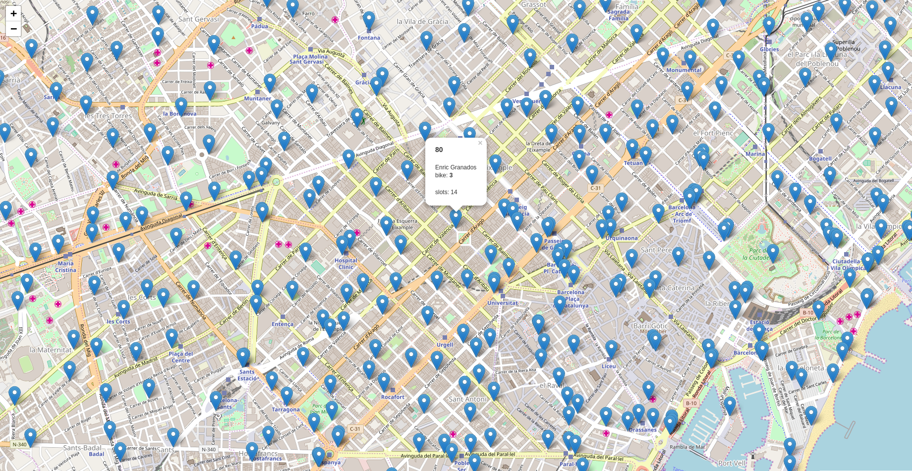

# Ejemplo servicio bicing Barcelona

## Acceso al servicio de datos del Bicing de Barcelona

En el portal Open data del Ayuntamiento de Barcelona podemos encontrar un dataset (conjunto de datos) que contiene las [estaciones del servicio de Bicing](http://opendata-ajuntament.barcelona.cat/data/es/dataset/bicing)

Si bien el Ayuntamiento de Barcelona no ofrece explicitamente el acceso a los datos del Bicing como un servicio, si que tiene un servicio de datos en tiempo real. La url la podemos encontrar presionando el botón de Descargar del recurso bicing.json


*url servicio de bicing*

Al abrir la url http://wservice.viabicing.cat/v2/stations en nuestro navegador observaremos que la respuesta es un archivo json con un conjunto de elementos que tienen las coordenadas de la localización de la estación de bicing, la disponibilidad de bicis, las estaciones más cercanas, etc.

Mapa que utiliza este servicio, [Ejemplo creado en la plataforma Instamaps](https://www.instamaps.cat/instavisor/1611695/dc769e48513f5df888691d2048005934/Estacions_bicing_i_carrils_bici_a_BCN_.html?3D=false#14/41.3962/2.1714)

El archivo json que retorna el servicio tiene coordenadas pero no es un fichero GeoJSON. [^1]

Para ver estos datos sobre un mapa crearemos un visor utilizando Leaflet. [^2]

## Creación de un visor

- Crer una carpeta con el nombre de *visor-bicing*.
- Crear un archivo con el nombre de *index.html* dentro de la carpeta
- Abrir el archivo index.html con un editor de texto y copiar el siguiente código.

```html
<!DOCTYPE html>
<html>
<head>
  <title>Servicio de Bicing realtime</title>
  <link rel="stylesheet" href="https://unpkg.com/leaflet@1.2.0/dist/leaflet.css" />
  <style>
    #map {
    position: absolute;
    top: 0;
    left: 0;
    bottom: 0;
    right: 0;
    }
  </style>
</head>
<body>
  <div id="map"></div>

  <script src="https://unpkg.com/leaflet@1.2.0/dist/leaflet.js"></script>
  <script type="text/javascript">
    var map = L.map('map');
    map.setView([41.3887, 2.1777], 13);

    L.tileLayer('http://{s}.tile.osm.org/{z}/{x}/{y}.png', {
      attribution: '&copy; <a href="http://osm.org/copyright">OpenStreetMap</a> contributors'
    }).addTo(map);
  </script>
</body>
</html>
```

- Abrir el archivo index.html en el navegador para ver que carga un mapa centrado en Barcelona.

- Agregar el plugin para cargar datos en tiempo real. Para ellos utilizaremos el plugin Leaflet Realtime [^3].  Copiar lo siguiente justo después de cuando carguemos la libreria de Leaflet.

```html hl_lines="20"
<!DOCTYPE html>
<html>
<head>
  <title>Servicio de Bicing realtime</title>
  <link rel="stylesheet" href="https://unpkg.com/leaflet@1.2.0/dist/leaflet.css" />
  <style>
    #map {
    position: absolute;
    top: 0;
    left: 0;
    bottom: 0;
    right: 0;
    }
  </style>
</head>
<body>
  <div id="map"></div>

  <script src="https://unpkg.com/leaflet@1.2.0/dist/leaflet.js"></script>
  <script src="https://cdnjs.cloudflare.com/ajax/libs/leaflet-realtime/2.1.0/leaflet-realtime.min.js"></script>
  <script type="text/javascript">
    var map = L.map('map');
    map.setView([41.3887, 2.1777], 13);

    L.tileLayer('http://{s}.tile.osm.org/{z}/{x}/{y}.png', {
      attribution: '&copy; <a href="http://osm.org/copyright">OpenStreetMap</a> contributors'
    }).addTo(map);
  </script>
</body>
</html>
```

- Agregar la capa de realtime del bicing a nuestro mapa. Siguiendo el ejemplo básico del plugin para cagar una capa, copiar lo siguiente al final de nuestro código de javascript.

```html hl_lines="29 30 31 32 33 34 35"
<!DOCTYPE html>
<html>
<head>
  <title>Servicio de Bicing realtime</title>
  <link rel="stylesheet" href="https://unpkg.com/leaflet@1.2.0/dist/leaflet.css" />
  <style>
    #map {
    position: absolute;
    top: 0;
    left: 0;
    bottom: 0;
    right: 0;
    }
  </style>
</head>
<body>
  <div id="map"></div>

  <script src="https://unpkg.com/leaflet@1.2.0/dist/leaflet.js"></script>
  <script src="https://cdnjs.cloudflare.com/ajax/libs/leaflet-realtime/2.1.0/leaflet-realtime.min.js"></script>
  <script type="text/javascript">
    var map = L.map('map');
    map.setView([41.3887, 2.1777], 13);

    L.tileLayer('http://{s}.tile.osm.org/{z}/{x}/{y}.png', {
      attribution: '&copy; <a href="http://osm.org/copyright">OpenStreetMap</a> contributors'
    }).addTo(map);

    var realtime = L.realtime({
      url: 'http://wservice.viabicing.cat/v2/stations',
      crossOrigin: true,
      type: 'json'
    }, {
      interval: 3 * 1000
    }).addTo(map);
  </script>
</body>
</html>
```

- Recargar la página para visualizar nuestra capa de bicing. Observaremos que no aparece ningún dato, esto es debido a que estamos llamando a un servicio que no está en nuestro dominio y nos da un error de CORS [^4]. Abrir la consola de desarrollador del navegador presionando F12 y veremos que cada 3 segundos aparecerá un error. Para evitar el error de CORS necesitamos un proxy [^5] en nuestro servidor web que pueda hacer la llamada al servicio de bicing y que nos devuelva el contenido.

## Creación del proxy

- Instalar Node.js [^6]. Descargar la última versión LTS (en este momento es la 10.13.0 LTS) y lo instalaremos con las opciones por defecto. Una vez instalado el Node abrir la consola para verificar que se ha instalado correctamente. Escribir

```bash
node -v
```

- Navegar hasta nuestra carpeta *visor-bicing* y escribir

```bash
npm init
```

Con este comando estaremos creando el archivo *package.json*. Este comando solicita varios elementos como, por ejemplo, el nombre y la versión de la aplicación. Por ahora, sólo hay que pulsar ENTER para aceptar los valores predeterminados.

- Instalar las dependencias para crear nuestro servicio de proxy. En este caso utilizaremos Express [^7] como servidor web y el módulo http-proxy [^8].

- Instalar el express y guardarlo en la lista de dependencias

```bash
npm install express --save
```

- Instalar el http-proxy y guardarlo en la lista de dependencias

```bash
npm install http-proxy --save
```

Al ejecutar estos comandos veremos que se crea una carpeta llamada *node_modules* donde se guardan los módulos instalados.

- Crear un archivo llamado *app.js* que servirá de proxy con el servicio de Bicing. Copiar lo siguiente en este archivo.

```js
var express  = require('express');
var app      = express();
var httpProxy = require('http-proxy');
var apiProxy = httpProxy.createProxyServer();
var serverBicing = 'http://wservice.viabicing.cat/v2/stations';

app.use(express.static('public'));

app.all("/bicing/*", function(req, res) {
  console.log('redirecting to Server1');
  apiProxy.web(req, res, {
    target: serverBicing,
    changeOrigin: false,
    ignorePath: true
  });
});

app.listen(3000);
```

- Probar que nuestro proxy está funcionando, escribiendo:

```bash
node app.js
```

- Abrir la url de nuestro proxy http://localhost:3000/bicing/ en el navegador.

- Crear una carpeta llamada *public* dentro de nuestra carpeta y mover el archivo index.html dentro de esa carpeta. Con esto ya podemos ver nuestra aplicación del mapa servida desde un servidor web y no abriendola directamente como habíamos hecho hasta ahora.

- Escribir en el navegador http://localhost:3000 para ver nuestro mapa.

### Modificar el mapa

- Modificar el archivo index.html para que llame al proxy que hemos creado. Cambiar la url del servicio de bicing *http://wservice.viabicing.cat/v2/stations* por nuestro proxy *http://localhost:3000/bicing/* (como el proxy y la aplicación están en el mismo servidor podríamos usar */bicing/*). Recargar la aplicación con Ctrl+F5 y veremos que el error que nos da ahora es diferente.

    En este caso el error es *Error: Invalid GeoJSON object.*. Este error es debido a lo que ya comentamos; la respuesta del servicio de Bicing no es un GeoJSON.

- Crear una variable llamada geojson que será la que contendrá el GeoJSON resultante de la transformación, antes de la declaración de nuestra capa de realtime

```html hl_lines="29 30 31 32"
<!DOCTYPE html>
<html>
<head>
  <title>Servicio de Bicing realtime</title>
  <link rel="stylesheet" href="https://unpkg.com/leaflet@1.2.0/dist/leaflet.css" />
  <style>
    #map {
    position: absolute;
    top: 0;
    left: 0;
    bottom: 0;
    right: 0;
    }
  </style>
</head>
<body>
  <div id="map"></div>

  <script src="https://unpkg.com/leaflet@1.2.0/dist/leaflet.js"></script>
  <script src="https://cdnjs.cloudflare.com/ajax/libs/leaflet-realtime/2.1.0/leaflet-realtime.min.js"></script>
  <script type="text/javascript">
    var map = L.map('map');
    map.setView([41.3887, 2.1777], 13);

    L.tileLayer('http://{s}.tile.osm.org/{z}/{x}/{y}.png', {
      attribution: '&copy; <a href="http://osm.org/copyright">OpenStreetMap</a> contributors'
    }).addTo(map);

    var geojson = {
      type: 'FeatureCollection',
      features: []
    };

    var realtime = L.realtime({
      url: 'http://wservice.viabicing.cat/v2/stations',
      crossOrigin: true,
      type: 'json'
    }, {
      interval: 3 * 1000
    }).addTo(map);
  </script>
</body>
</html>
```

- Modificar la aplicación para transformar la respuesta del bicing en un GeoJSON. Modificar nuestra capa realtime con el siguiente código

```html hl_lines="34 35 36 37 38 39 40 41 42 43 44 45 46 47 48 49 50 51 52 53 54 55 56 57 58 59 60 61 62 63 64 65 66 67 68"
<!DOCTYPE html>
<html>
<head>
  <title>Servicio de Bicing realtime</title>
  <link rel="stylesheet" href="https://unpkg.com/leaflet@1.2.0/dist/leaflet.css" />
  <style>
    #map {
    position: absolute;
    top: 0;
    left: 0;
    bottom: 0;
    right: 0;
    }
  </style>
</head>
<body>
  <div id="map"></div>

  <script src="https://unpkg.com/leaflet@1.2.0/dist/leaflet.js"></script>
  <script src="https://cdnjs.cloudflare.com/ajax/libs/leaflet-realtime/2.1.0/leaflet-realtime.min.js"></script>
  <script type="text/javascript">
    var map = L.map('map');
    map.setView([41.3887, 2.1777], 13);

    L.tileLayer('http://{s}.tile.osm.org/{z}/{x}/{y}.png', {
      attribution: '&copy; <a href="http://osm.org/copyright">OpenStreetMap</a> contributors'
    }).addTo(map);

    var geojson = {
      type: 'FeatureCollection',
      features: []
    };

    var realtime = L.realtime(function(success, error) {
        fetch('/bicing/')
        .then(function(response) {
            return response.json();
        })
        .then(function(data) {
            var stations = data.stations;
            for (var i = stations.length - 1; i >= 0; i--) {
                var station = stations[i];
                var feature = {
                    type: 'Feature',
                    properties: {
                        altitude: station.altitude,
                        bikes: station.bikes,
                        id: station.id,
                        nearbyStations: station.nearbyStations,
                        slots: station.slots,
                        status: station.status,
                        streetName: station.streetName,
                        streetNumber: station.streetNumber,
                        type: station.type
                    },
                    geometry: {
                        type: 'Point',
                        coordinates: [station.longitude, station.latitude]
                    }
                };
                geojson.features.push(feature);
            }
            success(geojson);
        })
        .catch(error);
    }, {
        interval: 3 * 1000
    }).addTo(map);
  </script>
</body>
</html>
```

- Recargar la aplicación y veremos los puntos de las estaciones de bicing. Si vamos a la pestaña de red (network) en la consola de desarrollador del navegador podremos ver que cada 3 segundos se hace una llamada a nuestro proxy.

- Crear un popup para ver la información de la estación al seleccionarla. Escribir justo después de donde definimos el intervalo

```html hl_lines="68 69 70 71 72 73 74 75"
<!DOCTYPE html>
<html>
<head>
  <title>Servicio de Bicing realtime</title>
  <link rel="stylesheet" href="https://unpkg.com/leaflet@1.2.0/dist/leaflet.css" />
  <style>
    #map {
    position: absolute;
    top: 0;
    left: 0;
    bottom: 0;
    right: 0;
    }
  </style>
</head>
<body>
  <div id="map"></div>

  <script src="https://unpkg.com/leaflet@1.2.0/dist/leaflet.js"></script>
  <script src="https://cdnjs.cloudflare.com/ajax/libs/leaflet-realtime/2.1.0/leaflet-realtime.min.js"></script>
  <script type="text/javascript">
    var map = L.map('map');
    map.setView([41.3887, 2.1777], 13);

    L.tileLayer('http://{s}.tile.osm.org/{z}/{x}/{y}.png', {
      attribution: '&copy; <a href="http://osm.org/copyright">OpenStreetMap</a> contributors'
    }).addTo(map);

    var geojson = {
      type: 'FeatureCollection',
      features: []
    };

    var realtime = L.realtime(function(success, error) {
        fetch('/bicing/')
        .then(function(response) {
            return response.json();
        })
        .then(function(data) {
            var stations = data.stations;
            for (var i = stations.length - 1; i >= 0; i--) {
                var station = stations[i];
                var feature = {
                    type: 'Feature',
                    properties: {
                        altitude: station.altitude,
                        bikes: station.bikes,
                        id: station.id,
                        nearbyStations: station.nearbyStations,
                        slots: station.slots,
                        status: station.status,
                        streetName: station.streetName,
                        streetNumber: station.streetNumber,
                        type: station.type
                    },
                    geometry: {
                        type: 'Point',
                        coordinates: [station.longitude, station.latitude]
                    }
                };
                geojson.features.push(feature);
            }
            success(geojson);
        })
        .catch(error);
    }, {
        interval: 3 * 1000,
        onEachFeature(f, l) {
            l.bindPopup(function() {
                return '<h3>' + f.properties.id + '</h3>' +
                    '<p>' + f.properties.streetName +
                    '<br/>bike: <strong>' + f.properties.bikes + '</strong></p>' +
                    '<p>slots: ' + f.properties.slots + '</p>';
            });
        }
    },).addTo(map);
  </script>
</body>
</html>
```

- Recargar la página y hacer click sobre alguna estación para ver su información en tiempo real.


*mapa de servicio de bicing*

## Referencias

[^1]: https://es.wikipedia.org/wiki/GeoJSON
[^2]: http://leafletjs.com/
[^3]: https://github.com/perliedman/leaflet-realtime
[^4]: https://developer.mozilla.org/es/docs/Web/HTTP/Access_control_CORS
[^5]: https://es.wikipedia.org/wiki/Servidor_proxy
[^6]: https://nodejs.org/es/
[^7]: http://expressjs.com/
[^8]: https://github.com/nodejitsu/node-http-proxy
